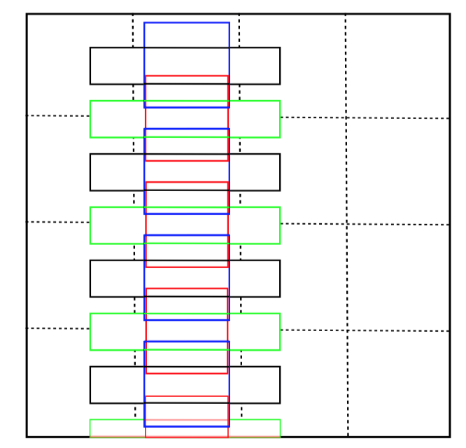

# TextBoxes: A Fast Text Detector with a Single Deep Neural Network

## 0. 背景

文本检测是 OCR 中比较关键的一步，类似于目标检测，文本检测也需要对图片中的文字进行检测定位。所以采用的检测网络也比较近似。但是文本检测又有不同于普通目标检测的地方，比如单个字符独立，有时对目标的检测需要结合上下文去理解段落语义。因此，可能存在上下文分割得比较远的情况。又如，不用于目标检测中常常出现的矩形结构，自然场景中的字符可能出现曲线结构，这些都会使得文本检测和目标检测相似而又有所不同。

这篇文章是白翔老师组的作品，OCR 这个方向，很喜欢他们组的文章。行文流畅易读，不像有些文章读起来云里雾里。也正是读得懂，所以试验结果复现起来简单、效果理想。

## 1. 贡献

这篇文章提出的主要贡献有三点，我总结就是，简单，有效，端到端。

## 2. 网络结构

### 2.1 网络基本结构 

网络结构源于 SSD，整个网络为28层全卷积网络 。backbone 为 VGG-16 中的 13 层（即去掉最后三层 FC），额外增加了 9 层卷积层，以及最后的6层Text-box。从图可以看到，到 conv4_3 是 VGG 的第13层，conv6-7为降采样一次后的两层，conv8_2，conv9_2, conv10_2 为再接三次降采样后的6层 global 为全局池化层。虚线联通 Text-box Layers，最后经过 NMS 得到最后结果。

还应该注意的一个细节是从 feature map 到 Text-box Layers 的卷积核（1*5），作者说这样是为了减少非文字部分对卷积核的干扰。

### 2.2 Text-box Layers

Text-Box layers 每对于每个 $$x_i$$, $$y_i$$ 预测 (12 * ( 4 + 2 )) ，共计 72 个值。其中，12 表示 12 个 default boxes ，4 表示坐标偏移量 $$Δx$$ , $$Δy$$, $$Δw$$, $$Δh$$。 2 表示 confidence 分类。

#### 2.2.1 Offsets

其中坐标偏移量的计算公式如下(下标为0的参数为默认初始值):

$$x = x_0 + w_0Δx​$$

$$y = y_0 + h_0Δy$$

$$ w = w_0exp(Δw) $$

$$ h = h_0exp(Δh) $$

#### 2.2.2 Default Boxes

default boxes 为长宽比为 1，2，3，5，7，10 的 6 个 boxes 加上下移半个单位的 6 个 boxes。

如上图，黑蓝红绿为一组框，黑蓝为长宽比5：1和1：1的基本框，绿红为对应的向下偏移框。因为这样的设定可以看到，TextBoxes 对竖直方向上的目标检测是不好的，因为没有竖直方向的 Default Boxes。出于什么原因考虑还不是很清晰。

### 2.3 Loss

$$ L(x, c, l, g) = \frac{1}{N} (L_{conf}(x, c) + \alpha L_{loc}(x, l, g)) ​$$

损失函数如上，与 SSD 近似，x 表示点在图像中坐标，c 为 confidence，l 为预测的坐标位置，g 为 ground true。其中 $$L_{conf}$$ 为 softmax,  ​$$L_{loc}​$$ 为 L1 smooth。

### 2.4 输入与训练

train input: 300*300

test input: whatever

SGD with 0.9 momentum $$ 5 * 10^{-4} $$ weight decay

initial lr $$10^{-3}$$ decayed to $$10{-4}$$ after 40k itertions

ICDAR 2013 数据集是在 SynthText 上训练后 fine tuning 的

## 3. 总结

基本就是采用了略微修改的 SSD 做的文字检测，不复杂，TITAN X 就可以玩，亲民。

