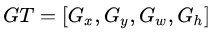
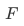
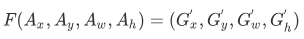
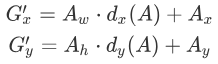
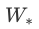
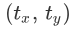
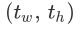

# Faster RCNN

经过 R-CNN 和 Fast RCNN 的积淀，*Ross B. Girshick* 在 2016 年提出了新的 Faster RCNN。在结构上，Faster RCNN 将特征抽取（feature extraction），proposal 提取，bounding box regression，classification 都整合在了一个网络中，使得综合性能有较大提高，在检测速度方面尤为明显（大概能够有 7 fps 左右）。


根据上图的总体网络，可以将 Faster RCNN 划分为 以下几个主要内容：

1. conv layers。首先使用一组基础的 `conv + relu + pooling` 层来提取 image 的 feature map，它将用于之后的步骤。
2. region proposal networks。RPN 网络用于生成 region proposals。该层主要通过 softmax 判断 anchors 属于 foreground 还是 background，然后再利用 bounding box regression 来修正 anchors，从而获得精确的 proposals。
3. roi pooling。该层主要负责收集输入的 feature maps 和 proposals，综合这两者信息后来提取 proposal feature maps，送入后续的全连接层来判定目标类别。
4. classification。利用 proposal feature maps 计算 proposal 的类别，同时再次 bounding box regression 获得检测框最终的精确位置。


下图为具体的 Faster R-CNN 网络：

 


## 1. conv layers

conv layers 部分共有 `13` 个 `conv` 层，`13` 个 `relu` 层，`4` 个 `pooling` 层。在 conv layers 中：

- 所有的 `conv` 层的参数为：
  - `kernel_size = 3`
  - `padding = 1`
  - `stride = 1`
- 所有的 `pooling` 层为：
  - `kernel_size = 2`
  - `padding = 0`
  - `stride = 2`


在 conv layers 中：

* 所有的卷积采用 `'SAME'` 模式，导致原图变为 `(M+2)x(N+2)` 大小，再做 `3x3` 卷积后输出 `MxN `。
* `pooling` 层 `kernel_size=2`，`stride=2` ，采用 `'VALID'` 模式。这样，每个经过 `pooling` 层的 `MxN` 矩阵，将会变为 `(M/2)x(N/2)` 大小。


所以一个 `MxN` 大小的矩阵经过 conv layers 固定变为 `(M/16)x(N/16)`。这样 conv layers 生成的 feature map 中都可以和原图对应起来。


## 2.  region proposal networks（RPN）

Faster RCNN 抛弃了传统的滑动窗口（Sliding Window）和 Selective Search  方法，直接使用 RPN 生成检测框，这也是 Faster R-CNN 的主要创新点，从而可以极大地提升检测框的生成速度。


下图展示了 RPN 网络的具体构成：


可以看到 RPN 网络实际分为两路：

- 通过 softmax 分类 anchors，从而获得 foreground 和 background
- 计算 anchors 的 bounding box regression 偏移量，以获得精确的 proposals


最后的 Proposal 层主要负责将 foreground anchors 和 bounding box regression 偏移量进行汇合，从而获取 proposals，同时剔除太小和超出边界的 proposals。其实整个网络到了 Proposal 层这里，就完成了相当于目标定位的功能。


### 2.1  anchors                                                                               

anchors 机制，简而言之，就是针对 feature maps 中的每个位置，生成 `9` 个矩形框，共有 `3` 种形状，长宽比为大约为： `{1:2, 1:1, 2:1}`三种，并将这些矩形框映射回 original images。如下图。实际上通过 anchors 就引入了检测中常用到的多尺度方法。


下图为论文中具体的 RPN 网络：

1. conv layers 中最后的 `conv5` 层 `num_output=256`（由于原论文采用的是 ZF model，其 `conv5` 层 `num_output=256` ），对应生成 `256` 张 feature maps，所以 feature map 上的每个点相当于都是 `256-d`
2. 在 `conv5` 之后，做了 `rpn_conv/3x3` 卷积且 `num_output=256`，相当于每个点又融合了周围 `3x3` 的空间信息，同时 `256-d` 不变
3. 假设在 feature map 中每个点上有 `k` 个 anchors（默认 `k=9`），而每个 anchor 要分 foreground 和 background，所以每个点由 `256d` feature 转化为 `cls=2k` scores；而每个 anchor 都有 `(x, y, w, h)` 对应 `4` 个偏移量，所以 `reg=4k` coordinates


【注】：由于生成的 anchors 过多，不能将它们全部用于训练。所以，会在合适的 anchors 中**随机**选取 `128` 个 positive anchors + `128` 个 negative anchors 进行训练。


**其实 RPN 最终就是在原图尺度上，设置了密密麻麻的候选 anchor。然后用 CNN 去判断哪些 anchor 中是有 object 的 foreground anchor，哪些是没有 object 的 background。**所以，这一步骤可以看成以一个二分类问题。


### 2.2  softmax 判定 foreground 与 background

一个 `MxN` 大小的矩阵到 RPN 网络之后变为 `(M/16)x(N/16)`，不妨设 `W=M/16`，`H=N/16`。在进入 reshape 与 softmax 之前，先做了 `1x1` 卷积，如下图：


该 `1x1` 卷积的 caffe prototxt 定义如下：

```python
layer {
  name: "rpn_cls_score"
  type: "Convolution"
  bottom: "rpn/output"
  top: "rpn_cls_score"
  convolution_param {
    num_output: 18   # 2(bg/fg) * 9(anchors)
    kernel_size: 1 pad: 0 stride: 1
  }
}
'''
可以看到其 `num_output=18`，也就是经过该卷积的输出图像为 `WxHx18` 大小。这也就刚好对应了 feature 
maps 每一个点都有 `9` 个 anchors，同时每个 anchors 又有可能是 foreground 和 background，所有
这些信息都保存 `WxHx(9*2)` 大小的矩阵。这么做的原因是：后面接 softmax 分类获得 foreground 
anchors，也就相当于初步提取了检测目标候选区域 box
'''
```


在 softmax 前后都接一个 reshape layer的原因：其实只是为了便于 softmax 分类。由于之前生成的 `WxHx(9*2)`  `bg/fg` anchors 矩阵，其在 caffe `blob` 中的存储形式为 `[1, 2x9, H, W]`。在 softmax 分类时需要进行 `fg/bg` 二分类，所以 reshape layer 会将其变为 `[1, 2, 9xH, W]` 大小，即单独“腾空”出来一个维度以便 softmax 分类，之后再 reshape 回复原状。


综上所述，RPN 网络中利用 anchors 和 softmax 初步提取出 foreground anchors 作为候选区域。


### 2.3  bounding box regression 原理

下图所示绿色框为飞机的 ground truth，红色为提取的 foreground anchors，即便红色的框被分类器识别为飞机，但是由于红色的框定位不准，这张图相当于没有正确的检测出飞机。所以希望采用一种方法对红色的框进行微调，使得 foreground anchors和 ground truth 更加接近。


对于窗口一般使用四维向量  表示，分别表示窗口的中心点坐标和宽高。对于下图，红色的框 `A` 代表原始的 foreground anchors，绿色的框 `G` 代表目标的 GT，现在的目标是寻找一种关系，使得输入原始的 anchor `A` 经过映射得到一个跟真实窗口 `G` 更接近的回归窗口 `G'`，即：

- 给定：anchor  和  
- 寻找一种变换 ，使得：，其中 


那么经过何种变换才能从图中的 `A` 变为 `G'` 呢？比较简单的思路就是:

- 先做平移

  

  ​			  

- 再做缩放

  ​			 


观察上面 4 个公式发现，需要学习的是  这四个变换。当输入的 anchor `A` 与 GT 相差较小时，可以认为这种变换是一种线性变换， 那么就可以用线性回归来建模对窗口进行微调（（注意，只有当 `A` 和 GT 比较接近时，才能使用线性回归模型，否则就是复杂的非线性问题了）。


接下来的问题就是如何通过线性回归获得这四个值（线性回归就是：给定输入的特征向量 ，学习一组参数 , 使得经过线性回归后的值跟真实值 非常接近，即。对于该问题，输入是 feature map，定义为 ；同时还有训练传入 `A` 与 GT 之间的变换量，即。输出是四个变换。那么目标函数可以表示为：

​				 

其中  是对应 anchor 的 feature map 组成的特征向量，  是需要学习的参数，  是得到的预测值（表示  `x`，`y`，`w`，`h`，也就是每一个变换对应一个上述目标函数）。为了让预测值  与真实值  差距最小，设计损失函数：

​				 

函数优化目标为：

​		 

需要说明，只有在 GT 与需要回归框位置比较接近时，才可近似认为上述线性变换成立。


说完 bounding box regression 原理，对应于 Faster RCNN 原文，foreground anchor 与 ground truth 之间的平移量  与尺度因子  的转换关系为：

​		 

对于训练 bouding box regression 网络回归分支，输入是 feature map ，监督信号是 anchor 与 GT 的差距 ，即训练目标是：输入 的情况下，使网络输出与监督信号尽可能接近。那么当 bouding box regression 工作时，再输入时，回归网络分支的输出就是每个 anchor 的平移量和变换尺度 ，显然可以用来修正 anchor 位置。


### 2.4 对 proposals 进行 bounding box regression

对于 RPN 网络的下面一条线路而言：


该 `1x1`卷积的 caffe prototxt定义为：

```python
layer {
  name: "rpn_bbox_pred"
  type: "Convolution"
  bottom: "rpn/output"
  top: "rpn_bbox_pred"
  convolution_param {
    num_output: 36   # 4 * 9(anchors)
    kernel_size: 1 pad: 0 stride: 1
  }
}

'''
可以看到其 `num_output=36`，即经过该卷积输出图像为 `WxHx36`，在 caffe blob存储为
`[1, 4x9, H, W]`，这相当于 feature maps 每个点都有 `9` 个 anchors，每个 anchor 
又都有 `4` 个用于回归的 [d_x(A), d_y(A), d_w(A), d_h(A)] 交换量
'''
```


### 2.5 proposal layer

其主要负责汇总所有的交换量和 foreground anchors。计算出精准的 proposals，以便送入后续的 RoI pooling layer。


proposal layer 的 caffe prototxt 定义为：

```python
layer {
  name: 'proposal'
  type: 'Python'
  bottom: 'rpn_cls_prob_reshape'
  bottom: 'rpn_bbox_pred'
  bottom: 'im_info'
  top: 'rois'
  python_param {
    module: 'rpn.proposal_layer'
    layer: 'ProposalLayer'
    param_str: "'feat_stride': 16"
  }
}
'''
proposal layer有 `3` 个输入：
 - fg/bg anchors 分类器结果 `rpn_cls_prob_reshape`
 - 对应的 bbox reg 的变换量 `rpn_bbox_pred`
 - `im_info`

另外还有参数 `feat_stride=16`。首先，`im_info`。对于一副任意大小 `PxQ` 图像，传入
Faster RCNN 前首先 reshape 到固定 `MxN`，`im_info=[M, N, scale_factor]` 
则保存了此次缩放的所有信息。然后经过 conv layers，经过 `4` 次 pooling 变为
`WxH=(M/16)x(N/16)` 大小，其中 `feature_stride=16` 则保存了该信息，
用于计算 anchor 偏移量。
'''
```


proposal layer forward 按照以下顺序依次处理：

1. 生成 anchors，利用对所有的 anchors 做 bbox regression 回归
2. 按照输入的 foreground softmax scores 由大到小排序 anchors，提取前 `pre_nms_topN`（例如 `6000`）个 anchors，即提取修正位置后的 foreground anchors
3. 限定超出图像边界的 foreground anchors 为图像边界（防止后续 RoI pooling 时 proposal 超出图像边界）
4. 剔除非常小（`width<threshold` 或 `height<threshold`）的 foreground anchors
5. 进行 NMS
6. 再次按照 NMS 后的 foreground softmax scores 由大到小排序fg anchors，提取前 `post_nms_topN`（例如 `300`）结果作为 proposal 输出


之后输出 。注意，由于在第 3 步中将 anchors 映射回原图判断是否超出边界，所以这里输出的 proposals 是对应 `MxN` 输入图像尺度的，这点在后续网络中有用。严格意义上将，检测应该到此就结束了，后续部分应该属于识别。


RPN 网络结构就介绍到这里，总结起来就是：**生成 anchors -> softmax 分类器提取 fg anchors -> bbox reg 回归 fg anchors -> proposal layer 生成 proposals**。


## 3. RoI pooling

RoI pooling 层主要负责收集 proposals，并计算出 proposal feature maps，送入后续网络。Rol pooling 层有两个输入：

1.  原始的 feature maps
2.  RPN 输出的 proposal boxes（大小各不相同）


### 3.1 为何需要 RoI pooling

对于传统的 CNN 网络，当网络训练好后输入的图像尺寸必须是固定值，同时网络输出也是固定大小的 vector 或 matrix。如果输入图像大小不定，这个问题就变得比较麻烦。为了这种问题，有两种解决办法：

1.  从图像中 crop 一部分传入网络
2. 将图像 warp 成需要的大小后传入网络


从上图可以看到，无论采取那种办法都不好：

* crop 后破坏了图像的完整结构
* warp 破坏了图像原始形状信息。。


RPN 网络生成 proposals 的过程为：对 foreground anchors 进行 bounding box regression，那么这样获得的 proposals 也是大小形状各不相同，即也存在上述问题。所以可以利用 RoI pooling 来解决这个问题。


### 3.2 RoI pooling 原理

RoI pooling layer 的 caffe prototxt 的定义为：

```python
layer {
  name: "roi_pool5"
  type: "ROIPooling"
  bottom: "conv5_3"
  bottom: "rois"
  top: "pool5"
  roi_pooling_param {
    pooled_w: 7
    pooled_h: 7
    spatial_scale: 0.0625 # 1/16
  }
}
```


RoI pooling forward 过程为：

- 由于 proposal 是对应 `M×N` 尺度的，所以首先使用 `spatial_scale` 参数将其映射回 `(M/16)×(N/16)` 大小的 feature map 尺度
- 再将每个 proposal 对应的 feature map 区域水平分为 `pooled_w × pooled_h` 的网格
- 对网格的每一份都进行 max pooling 处理。


这样处理后，即使大小不同的 proposals 输出结果都是 `pooled_w × pooled_h` 固定大小，实现了固定长度输出。


## 4. classification

classification 部分利用已经获得的 proposal feature maps，通过 fc layer 与 softmax 计算每个 proposal 具体属于那个类别，输出 `cls_prob` 概率向量；同时再次利用 bounding box regression 获得每个 proposal 的位置偏移量 `bbox_pred`，用于回归更加精确的目标检测框。


分类部分网络结构如下图所示：


从 PoI pooling 获取到 `7x7=49` 大小的 proposal feature maps 后，送入后续网络，接着进行如下两个步骤：

1. 通过 fc layer 和 softmax 对 proposals 进行分类（这实际上已经是识别的范畴）
2. 再次对 proposals 进行 bounding box regression，获取更高精度的 rect box

