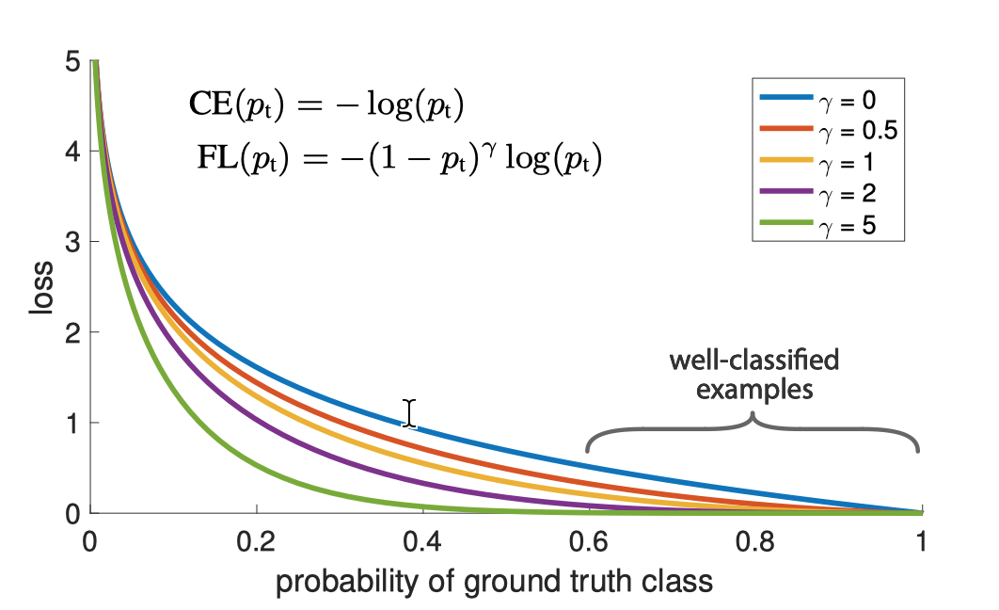
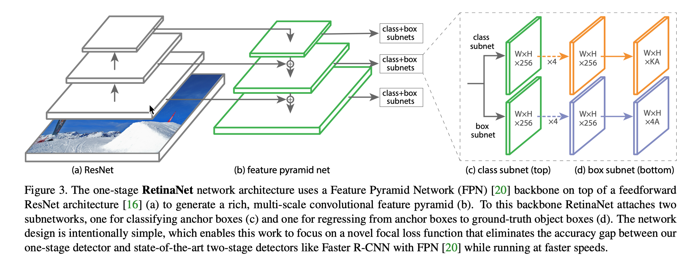

# Focal Loss for Dense Object Detection

## 0. 背景

​	one-stage 的目标检测方法，如 YOLO，SSD 等，速度在高性能显卡上能够得到近乎实时的效果。但在精度上是低于 two-stage 目标检测方法，如 Faster RCNN的。这篇文章是 2017 年最佳学生论文，目标在于解决 one-stage 目标检测精度低于 two-stage 精度的问题。并提出了 RetinaNet ，一种基于 Focal Loss 的 one-stage 网络，在 COCO 数据集上刷到了 40.8 AP。

## 1. 思路

​	文章认为，one-stage 方法之所以精度低于 two-stage 方法的关键在于样本不均衡。

​	two-stage 在 RPN 类似的网络中已经对前后景进行了二分类，这样在识别的时候，类别不均衡最多是前景类别中的不均衡。而 one-stage 方法会对整个图片进行回归，那无论前景背景都会作为类别进行分类，而我们可以很自然理解图片中关键信息是少于无关信息的。而 anchor 产生的大量需要分类的前景，又没有 two-stage 方法中 RPN 的二分类分类器，这对于网络分类的稳定性是一个极大的问题。

​	找到改进的目标后，作者把手段放在了改进 Loss 上，并把这种降低类别不均衡问题的 Loss 叫做 Focal Loss。

## 2. Focal Loss

### 2.1  cross entropy loss

​	首先引入二分类交叉熵损失函数:
$$
CE(p, y)=\begin{cases}-log(p),\quad if\ y = 1 
\\\\-log(1-p), \quad otherwise\end{cases}
$$

​	普通的交叉熵对于正样本而言，输出概率越大损失越小。对于负样本而言，输出概率越小则损失越小。此时的损失函数在大量简单样本的迭代过程中比较缓慢且可能无法优化至最优。

### 2.2 Balanced Cross Entropy

​	接下来引出因子 $\alpha$ 来平衡正负样本数量不平衡问题。

​	$CE(p_t) = -\alpha log(p_t)$， $\alpha \in [0, 1]$

### 2.3 Focal Loss

​	再引出 Focal Loss 

​	$FL{p_t} = - (1-p_t)^{\gamma}log(p_t)$

​	增加了 $\gamma$ 因子，这样做的目的是，使得简单样本的损失函数变低，而较难分类的样本损失函数增多。

如上图可知，当预测值越接近 1 时，$\gamma > 0 $ 时，loss 的值相较于 CE Loss 会更接近于 0。当预测值处在一个相对较小的值时，又会有一个较大的 Loss。这样就起到了抑制相对简单的样本对网络的影响，增大了学习较难样本的可能性。

接下来，为 Focal Loss 添加类别平衡因子

$FL(p_t) = -\alpha(1-p_t)^{\gamma}log(p_t)$

论文中解释为 $\alpha$ 因子为经验所得，能略微提升网络效果

## 3. RetinaNet

### 3.1 Network

接下来作者提出了一种基于 ResNet 的网络来验证 Focal Loss 的有效性。

- 网络骨架为 ResNet，后跟一个 FPN 目的是提取多尺度特征。
- 再跟两个识别网络（subnet），对多尺度上的特征图进行分类，两个 subnet 在所有尺度权值共享
  - 一个 class subnet 负责分类
  - 一个 box subnet 负责检测检测 4 个坐标信息
- 文中采用的 Anchor 与 Faster RCNN 相同

### 3.2 推理和训练

#### 3.2.1 推理

对图片进行前馈传播后，取置信度最高的前1k个，且阈值大于 0.05 的点。并用 IOU 0.5 做 NMS。得到最终结果。

#### 3.2.2 训练

主要是做了对比 Focal Loss 和没有 Focal Loss 下的训练并对比。在无 Focal Loss 的情况下精度与 DSSD 相当。添加 Focal Loss 后精度约增加 5-7 个点。