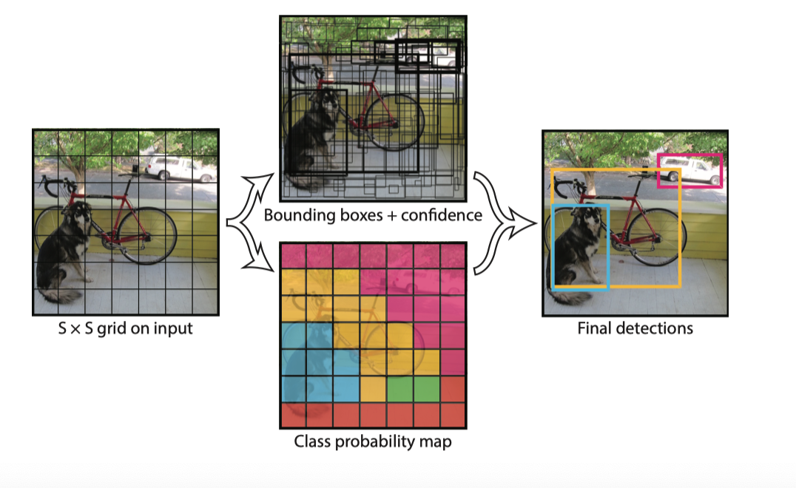

# [You Only Look Once: Unified, Real-Time Object Detection](https://arxiv.org/abs/1506.02640)

## 0. 为什么读这篇论文？
​	One-stage 目标检测开山作，脑洞大开，原来目标检测还可以这么玩。

## 1. 背景
​	YOLO出现以前，目标检测（ RCNN ，Fast RCNN ，Faster RCNN）都是分两步走，特征提取和分类是两个模块。主要是思路里我们认为目标检测是两个问题的回答，一是回答我们想检测的物体在哪里？二是回答我们想要检测的物体是什么？YOLO作者脑路清奇，将目标检测问题转化为回归问题。直接让 DNN 告诉我们哪里是物体，是什么物体。

## 2. 优缺点
1. 提出了目标检测新思路
2. 速度快，45fps
3. 正确率和 Faster RCNN 还是有很大差距的
4. 对小物体以及靠得很近的物体天然检测率低
5. 泛化能力偏弱

## 3. 模型及基本思想
### 3.1 YOLO 模型

包含 24 个卷积层和 2 个全连接层

其中前 20 个卷积层在 ImageNet 上进行预训练

输入为 448 * 448 的图片

输出为 S * S * (5 * B + 20) （对应图中最后输出 7 * 7 * 30）

其中

​	S: grid cell, 等于 7 (每个 cell 负责检测中心落在这个 cell 上的物体)

​	5: 表示 x y w h confidence 5个参数，负责预测目标选框 x y w h 以及 是否是物体

​		此处的 x y 是按照 cell 大小映射到 [0,1] 的

​		w y 是按照整幅图 w, h 同样映射到 [0, 1] 区间 

​	B: 取2，表示每个 cell 预测的物体个数

​	C: 预测物体类别

除最后一层外，激活函数为 leaky-Relu

### 3.2 YOLO 检测流程

- 将图片输入 YOLO 的网络后，最后输出会是一个 7 * 7 * 30 的特征
- 其中 7 * 7 对应了原始图片中 7 * 7 个分区
- 30 维所包含的信息分两个部分，一部分包括分区中的信息，一部分包括类别的概率
- 预测时，每个 bounding box 会有一个 confidence 这个值乘以类别概率将得到一个 class-specific confidence score，用阈值，和 NMS 处理得到最后的预测结果
- 无论 B 如何设置，每个 cell 实际上只会预测一个物体类别

### 3.3 训练

1. 前 20 层在 ImageNet 进行预训练， 得到了 88% top5 的正确率
2. 随机初始化后4个卷积层和两个卷积层
3. 输入为 448 * 448 的图片，并对 bounding box (x, y, w, h) 进行归一化
4. 激活函数除最后一层均使用 leaky-ReLU
5. 由于是回归问题，因此直接采用均方误差来进行训练

为了调节 Loss 中各项的比重，因此修改了 $$ λ_{coord} = 5 $$ ,  $$ λ_{noobj} =0.5 $$

只有当某个网格中有object的时候才对classification error进行惩罚

只有当某个box predictor对某个ground truth box负责的时候，才会对box的coordinate error进行惩罚，而对哪个ground truth box负责就看其预测值和ground truth box的IoU是不是在那个cell的所有box中最大

## 4 总结

可以看到，YOLO提出时，快速算法中 YOLO 是没有对手的，但相比较于 Faster R-CNN 也还有差距。作者自己手撸了一个 backbone，在 ImageNet 上的 top-5 是 88 %，低于 VGG-16，所以光是改改 backbone，应该也能对最后的 mAP 有提升。大神脑回路清奇主要就体现在这，用 VGG-16 GoogLeNet 就是不用，自己手撸一个来搞。

当然这篇文章最重要的不在此，主要是提出的单步目标检测为目标检测这个方向提供了思路，这种创新，NB。也告诉了我们 DL 可以玩的花样还有很多
